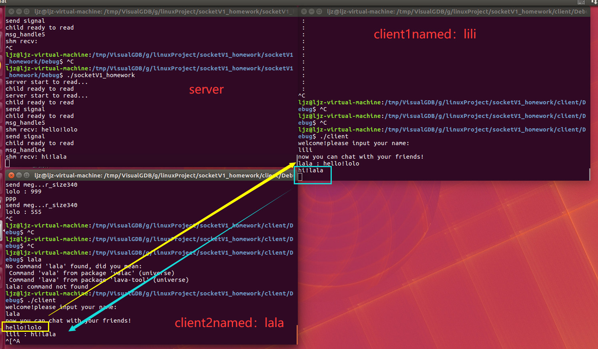

# MultiprocessGroupChat

> 使用多进程编程和socket通讯写的群聊功能

这是一个linux学习项目，项目需求如下：

> 在终端命令行实现一个群聊功能，使用一个TCP服务器，并可以接入多个TCP客户端，每个客户端发出的信息将可以在其他所有接入服务器的客户端收到，也就是可以实现群聊天功能
>
> 提醒：
>
> 1.群发，父进程要保存所有的accept_fd，可以存到向量中
>
> 2.可以使用结构体发送，通讯考虑IPC的几种方法：共享内存，消息队列，信号等
>
> 3.要求使用多进程编写，不使用多线程

# 项目涉及知识点

- 多进程编程(fork,getpid函数)

- 基本TCP套接字编程（socket,bind,listen,accept,connect函数）

- 带值信号的发送和接收：sigaction函数（sigaction结构体、siginfo_t 结构体）、sigqueue函数（sigval联合体）

- IPC之共享内存（shmget函数、shmat函数、shmdt函数）

- 结构体，向量等基础知识

  

# 业务实现逻辑
1、服务器，客户端使用TCP建立连接，套接字通讯

2、服务器：进行共享内存和信号绑定的初始化，在死循环中，当有一个客户端连接到服务器的时候，accept会返回一个新的套接字描述符，服务器的父进程用向量记录下已连接套接字描述符acc_fd。

3、服务器每accept到一个客户端，就创建一个子进程对应处理一个客户端的业务，在服务器的一个子进程中，死循环read监听从客户端发来的消息，一旦接收到，就将消息包（结构体）写入共享内存中，并发信号（带有acc_fd）告诉父进程收到了信号

4、在父进程执行信号处理函数，信号处理函数中负责读出共享内存中的消息包，并群发给所有客户端（遍历保存acc_fd的向量），与信号中的acc_fd比对，可以避免自己说的话发给自己

5、客户端：首先要求用户输入一个name作为客户端标识，然后使用一个子进程死循环负责不断read接收服务器群发的消息，父进程阻塞等待接收用户输入

# 如何使用

两个cpp对应两个项目，socketV1_homework.cpp为服务器端代码，client.cpp为客户端代码，您需要把他们放在两个项目中各种编译。运行时请注意先./socketV1_homework，也就是先打开服务器，再./client

您可以直接在linux内使用codeblocks，或在windows下使用vs加visualGDB远程SSH进行开发，新建工程并将源代码拷贝入并编译生成即可

# help

All kinds of comments and exchanges are welcome. If you need help or further communication, please email me at: 949761064@qq.com